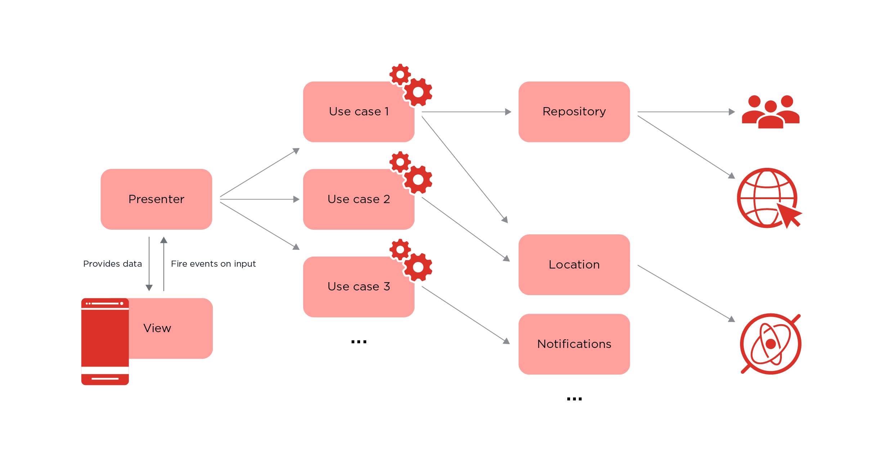
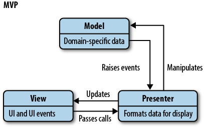

# 整洁前端

> Clean Frontend

## 前端的恶梦

在我最近的一个项目里，我使用了 Angular 和混合应用技术编写了一个实时聊天应用。为了方便这个应用直接修改，无缝地嵌入到其它应用程序中。我尽量减少了 Component 和 Service 的数量——然而，由于交互复杂 Component 的数量也不能减少。随后，当我们完成了这个项目的时候，主的组件的代码差不多有 1000 行。这差不多是一个复杂的应用的代码数。在我试图多次去重构代码时，我发现这并不是一件容易的事：太多的交互。导致了 UI 层的代码，很难被抽取出去。只是呢，我还能做的事情是将一些业务逻辑抽取出来，只是怎么去抽取了——这成了我的一个疑惑。

MVP 嘛，逻辑不都是放到 Presenter 里，还有其它的招吗？

### AVR is evil

Angular、Vue 和 React 都是一些不错的框架，但是它们都是恶魔——因为我们绑定了框架。尽快我们可以很快地从一个 React 的框架，迁移应用到其它类 React 框架，诸如 Preact；我们可以从一个类似于 Vue 的框架，迁移应用到其它类 Vue 的应用。但是我们很难从 React 迁移到 Angular，又或者是 Vue 迁移到 Angular。万一有一天，某个框架的核心维护人员，健康状况不好，那么我们可能就得重写整个应用。这对于一个技术人员/Tech Lead/项目经验/业务人员来说，这种情况是不可接受的。

所以，为了应对这些框架带来的问题，我们选择 Web Components 技术，又或者是微前端技术，从架构上切开我们的业务。但是它们并不是银弹，它们反而是一个累赘，限定了高版本的浏览器，制定了更多的规范。与此同时，不论是微前端技术还是 Web Components，它们都没有解决一个问题：**框架绑定应用**。

框架绑定应用，就是一种灾害。没有人希望哪一天因为 Java 需要高额的付费，而导致我们选择重写整个应用。

### 组件化及 Presenter 过重

应对页面逻辑过于重的问题，我们选择了组件化。将一个页面，拆分成一系列的业务组件，再进一步地对这些业务组件进行地次细分，形成更小的业务组件，最后它们都依赖于组件库。

可是呢，细化存在一个问题是：**更难以摆脱的框架绑定**。与此同时，我们大量的业务逻辑仍然放置在 Presenter 里。我们的 Presenter 充满了大量的业务逻辑和非业务逻辑：

 - 页面展示相应的逻辑。诸如点击事件、提交表单等等。
 - 状态管理。诸如是否展示，用户登录状态等等。
 - 业务逻辑。诸如某个字符串，要用怎样的形式展示。
 - 数据持续化。哪些数据需要存储在 LocalStorage，哪些数据存储在 IndexedDB 里？

为了应对 Presenter 过重的问题，我们使用了 Service 来处理某一块具体的业务，我们使用了  Utils、Helper 来处理一些公共的逻辑。哪怕是如此，我们使用 A 框架编写的业务逻辑，到了 B 框架中无法复用。

直到我最近重新接触了 Clean Architectrue，我发现 Presenter 还是可以进一步拆分的。

## 整洁的前端架构

Clean Architecture 是由 Robert C. Martin 在 2012 年提出的（PS：时间真早）。最早，我只看到在 Android 应用上的使用，一来 Android 开发使用的是 Java，二来 Android 应用有很重的 View 层。与此同时，在 7 年的时间里，由于前后端的分离，UI 层已经从后端的部分消失了——当然了，你也可以说 JSON 也是一种 View（至少它是可见的）。尽管，还存在一定数量的后端渲染 Web 应用，但是新的应用几乎不采用这样的模式。

但是，在 9012 年的今天，前端应用走向了 MV* 的架构方案，也有了一层很重的 View 层——类似于过去的后端应用，或者后端应用。相似的架构，也可以在前端项目中使用。

### 整洁架构

 Robert C. Martin 总结了六边形架构（即端口与适配器架构）、DCI （Data-Context-Interactions，数据-场景-交互）架构、BCI（Boundary Control Entity，Boundary Control Entity）架构等多种架构，归纳出了这些架构的基本特点：

 - 框架无关性。系统不依赖于框架中的某个函数，框架只是一个工具，**系统不能适应于框架**。
 - 可被测试。业务逻辑脱离于 UI、数据库等外部元素进行测试。
 - UI 无关性。不需要修改系统的其它部分，就可以变更 UI，诸如由 Web 界面替换成 CLI。
 - 数据库无关性。业务逻辑与数据库之间需要进行解耦，我们可以随意切换 LocalStroage、IndexedDB、Web SQL。
 - 外部机构（agency）无关性。系统的业务逻辑，不需要知道其它外部接口，诸如安全、调度、代理等。

如你所见，作为一个普通（不分前后端）的开发人员，我们关注于业务逻辑的抽离，让业务逻辑独立于框架。而在前端的实化，则是让前端的业务逻辑，可以独立于框架，只让 UI（即表现层）与框架绑定。一旦，我们更换框架的时候，只需要替换这部分的业务逻辑即可。

为此，基于这个概念 Robert C. Martin  绘制出了整洁架构的架构图：


如图所示 Clean Architecture 一共分为四个环，四个层级。环与环之间，存在一个依赖关系原则：**源代码中的依赖关系，必须只指向同心圆的内层，即由低层机制指向高级策略**。其类似于 SOLID 中的依赖倒置原则：

 - 高层模块不应该依赖低层模块，两者都应该依赖其抽象
 - 抽象不应该依赖细节，细节应该依赖抽象

与此同时，四个环都存在各自核心的概念：

 - 实体 Entities （又称领域对象或业务对象，实体用于封装企业范围的业务规则）
 - 用例 Use Cases（交互器，用例是特定于应用的业务逻辑）
 - 接口适配器 Interface Adapters （接口适配器层的主要作用是转换数据）
 - 框架和驱动（Frameworks and Drivers），最外层由各种框架和工具组成，比如 Web 框架、数据库访问工具等

这个介绍可能有些简单，让我复制/粘贴一下更详细的解释：

**实体（Entities）**，实体用于封装企业范围的业务规则。实体可以是拥有方法的对象，也可以是数据结构和函数的集合。如果没有企业，只是单个应用，那么实体就是应用里的业务对象。这些对象封装了最通用和高层的业务规则，极少会受到外部变化的影响。任何操作层面的改动都不会影响到这一层。

**用例（Use Cases）**，用例是特定于应用的业务逻辑，一般用来完成用户的某个操作。用例协调数据流向或者流出实体层，并且在此过程中通过执行实体的业务规则来达成用例的目标。用例层的改动不会影响到内部的实体层，同时也不会受外层的改动影响，比如数据库、UI 和框架的变动。只有而且应当应用的操作发生变化的时候，用例层的代码才随之修改。

**接口适配器（Interface Adapters）**。接口适配器层的主要作用是转换数据，数据从最适合内部用例层和实体层的结构转换成适合外层（比如数据持久化框架）的结构。反之，来自于外部服务的数据也会在这层转换为内层需要的结构。

**框架和驱动（Frameworks and Drivers）**。最外层由各种框架和工具组成，比如 Web 框架、数据库访问工具等。通常在这层不需要写太多代码，大多是一些用来跟内层通信的胶水代码。这一层包含了所有实现细节，把实现细节锁定在这一层能够减少它们的改动对整个系统造成的伤害。

Done！

概念就这么扯到这里吧，然后看看相应的实现。

###  Clean Architecture 数据流

上图中的右侧部分表示的是相应的数据流，数据从 Controller 流出，经过 Use Case（用例）的输入端口，然后通过 Use Case 本身，最后通过 Use Case 输出端口返回给 Presenter。

让我们来看一个较为直观的例子：



上图（来源，见参考文章）是一个 Android 应用的数据流示意图。

对于只懂得前端的开发大致说明一下，Android 的 View 和 Presenter 的关系。在前端应用中，我们假设以使用 Component 来表示一个组件，如 Angular 中的 HomepageComponent。而这个 HomepageComponent 中，它必然充满了一些无关于页面显示的逻辑，比如从后端获取显示数据之类的。而 Java 的写法本身是比较臃肿的，所以在 Android 的 Activity 中就会充斥大量的代码。为此，Android 的开发人员们，采用了 MVP 架构，通过 Presenter 来将与显示无关的行为，从 View 中抽离出来。

### 优缺点

说了，这么多，最后让我们看一下优缺点。优点吧，就这些——笑：

 - 框架无关性。
 - 可被测试。
 - UI 无关性。
 - 数据库无关性。
 - 外部机构（agency）无关性。

除此，还有：

 - 定义了特定功能的代码放在何处
 - 可以在多个项目共享业务逻辑

相应的它还有大量的缺点：

**过于复杂**。数据需要经过多层处理，Repository 转为 Entity，经过 Usecase 转为 Model，再交由 Presenter 处理，最后交由 View 显示。一个示例如下所示（源自[Android-Clean-Boilerplate](https://github.com/dmilicic/Android-Clean-Boilerplate/tree/example)）：

> MainActivity ->MainPresenter -> WelcomingInteractor -> WelcomeMessageRepository -> WelcomingInteractor -> MainPresenter -> MainActivity

**过度设计**。事到如今，我们做了大量的设计，对于一个简单的工程来说，这样的模式可能是过度式的设计。

**大量的模板式代码**。Usecase、Model 等一系列重复的模板式代码。

**陡峭的学习曲线**。不用我多说，看这篇文章的长度。

所以，在采用之前，请再次考虑一下，**你的应用是否足够的复杂**——业务上的复杂度，代码上的复杂度等等。

## 前端 Clean 架构

说了，这么多，让我们来结合一下前端，设计一下新的前端架构。

### 客户端 Clean 架构 + MVP

与后端架构相比， Android 的 MVP 架构  + Clean 架构更与前端相似，为此我们再说看看它们结合的一个示例：


与上一个数据流的相比，这个数据流图更容易落地。其与传统的 MVP（Model-View-Presenter）架构相比：



基于 Clean Architecture 方案时，则多了一个领域层（图中的 Domain Layer，即业务层），在这一层领域层里，放置的是系统相关的用例（Usecase），而用例所包含的则是相应的业务逻辑。

### Clean Architecture + MVP + 组件化

上述的 MVP + Clean Architecture 的架构方式，对于前端应用的架构设计来说，也是相当合适的。稍有不同的是，我们是否有必要将一个组件分为 Presenter + View。以我的角度来说，对于大部分前端应用来说，并没有这么复杂的情况，因为前端有组件化架构。

所以，最后对于我们的前端应用而言，架构如下图所示：


这里，只是对于 Presenter 进行更细一步的细化，以真实的模式取代了 MVP 中的 Presenter。

## 实践

值得注意的是，我们在这里违反了依赖倒置原则。原因是，这里的注入带来了一定的前端复杂度，而这个注入并非是必须的——对于大部分的前端应用而言，只会有单一的数据源，那便是后端数据。

### 单体式分层架构

在我起初设计的版本里，参照的 Clean Angular 工程（[Angular Clean Architecture](https://github.com/im-a-giraffe/angular-clean-architecture)）里，其采用的是单体式的 Clean Architecture 分层结构：

```
├── core
│   ├── base				// 基础函数，如 mapper 等
│   ├── domain				// 业务实体
│   ├── repositories        // repositories 模型
│   └── usecases			// 业务逻辑
├── data 					// 数据层
│   └── repository          // 数据源实现
└── presentation            // 表现层
```

这个实现还是相当不错的，就是过于重视理论——抽象相当的繁琐，导致有点不接地气。我的意思说，没有多少前端人员，愿意按照这个模式来写。

### 微服务式分层架构

考虑到 usecase 的业务相关性，及会存在大师的 usecase，我便将 usecase 移到了 data 目录——也存在一定的不合理性。后来，我的同事泽杭——一个有丰富的 React 经验前端开发，他提出了 Redux 中的相关结构。最后，我们探讨出了最后的目录结构：

```
├── core			    // 核心代码，包含基本服务和基础代码
├── domain				// 业务层代码，包含每个业务的单独 Clean 架构内容
│   └── elephant		// 某一具体的业务
├── features			// 公共页面组件
├── protected			// 有权限的页面
├── public				// 公共页面
└── shared				// 共享目录
```

对应的 elephant 是某一个具体的业务，在该目录下包含了一个完整的 Clean Architecture，相应的目录和文件如下所示：

```
├── model
│   └── elephant.model.ts                         // 核心业务模型
├── repository
│   ├── elephant-web-entity.ts                    // 数据实体，简单的数据模型，用来表示核心的业务逻辑
│   ├── elephant-web-repository-mapper.ts         // 映射层，用于核心实体层映射，或映射到核心实体层。
│   └── elephant-web.repository.ts                // Repository，用于读取和存储数据。
└── usecases
    └── get-elephant-by-id-usecase.usecase.ts     // 用例，构建在核心实体之上，并实现应用程序的整个业务逻辑。
```

我一直思考这样的模式是否有问题，直到我看到我司大佬 Martin Folwer 写下的一篇文章《[PresentationDomainDataLayering](https://martinfowler.com/bliki/PresentationDomainDataLayering.html)》——终于有人背锅了。文章中提到了这图：


这个分层类似于微服务的概念，在我所熟悉的 Django 框架中也是这样的结构。也因此从理论和实践上不看，并不存在任何的问题。

## 相关资料

推荐书目：《整洁架构之道》

相关文章：

 - [Android Architecture: Part 1 – Every New Beginning is Hard](https://five.agency/android-architecture-part-1-every-new-beginning-is-hard/) 对应的中文翻译版本：[Android架构：第一部分-每个新的开始都很艰难 (译)](https://dimon94.github.io/2018/05/07/Android%E6%9E%B6%E6%9E%84%EF%BC%9A%E7%AC%AC%E4%B8%80%E9%83%A8%E5%88%86%20-%20%E6%AF%8F%E4%B8%AA%E6%96%B0%E7%9A%84%E5%BC%80%E5%A7%8B%E9%83%BD%E5%BE%88%E8%89%B0%E9%9A%BE%20(%E8%AF%91)/)
 - [Thoughts on Clean Architecture and MVP](http://wahibhaq.com/blog/clean-architecture-mvp-summary/)
 - [Approach to Clean Architecture in Angular Applications — Theory](https://medium.com/@thegiraffeclub/angular-clean-architecture-approach-fcfe32e983a5)
 - [DDD, Hexagonal, Onion, Clean, CQRS, … How I put it all together](https://herbertograca.com/2017/11/16/explicit-architecture-01-ddd-hexagonal-onion-clean-cqrs-how-i-put-it-all-together/)
 - [PresentationDomainDataLayering](https://martinfowler.com/bliki/PresentationDomainDataLayering.html)

## 其它 

> 它不是一颗银弹。使用 MVP 并不妨碍开发人员将 UI 逻辑放在 View 中，使用 Clean Architecture 不会阻止业务逻辑泄漏到表示层。

我们仍然在优化相关的架构中，代码见：https://github.com/phodal/clean-angular
