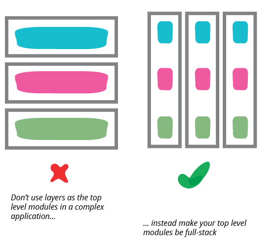

Clean Angular in Angular
===

Phodal 

AVR is evil
===

Angular is not Clean


React is not Clean


Vue is not Clean


框架 x 独立
===


Angular MVP
===

Container   | Integrates with other application layers
Component   |

Presentational | Pure presentational, interactive view,
Component       | Thin component model

Presenter   | Complex
            | presentational LOGIC

Data Flow
===


Presenter
===

 - Presentation
 - State Management
 - Business Logic
 - Persistence
 
Clean Architecture
===

 - Independence from Framework
 - Testable
 - Independent of UI
 - Independent of Database
 - Independent of any external agents (Security, scheduling, etc)

OO 设计：SOLID
===

 -  S - Single Responsibility Principle
 -  O - Open/Closed Principle
 -  L - Liskov Substitution Principle
 -  I - Interface Segregation Principle
 -  D - Dependency Inversion Principle

依赖倒置原则 
===

 -  High-level modules should not depend on low-level
modules. Both should depend on abstractions.

 -  Abstractions should not depend on details. Details should
depend on abstractions.

Clean Architecture
===


核心概念
===

 -  Entities (Enterprise wide Business Rules or Business
Objects of a Single Application)
 -  Use Cases (Application Specific Business Rules)
 -  Interface Adapters (Presenters, Controllers, Gateways, etc)
 -  Frameworks and Drivers (Android Framework, Web, etc)

Clean Architecture 实现
===


数据流
===


优点
===

 -  One level of breakdown for testability
 -  Easier to implement functionalities like caching, storage, etc.
 -  Reusable Usecases
 -  Defining where to add code for specific functionality
 -  Multiple projects can share domain/business logic
 -  Implement different presentation patterns like MVVM, MVI,
etc.

缺点
===

 -  Dependent on RxJava
 -  Boilerplate code
 -  UseCaseExecutor takes away several RxJava benefits
 -  Request and Response Models in UseCase
 -  Steep learning curve
 -  Over-Engineering, perhaps?

Presentation-Domain-Data-Layering
===

[PresentationDomainDataLayering](https://martinfowler.com/bliki/PresentationDomainDataLayering.html)


纵向分层
===

分层是一种反模式



===

Angular
===

```
├── model
│   └── elephant.model.ts                         // 核心业务模型
├── repository
│   ├── elephant-web-entity.ts                    // 数据实体，简单的数据模型，用来表示核心的业务逻辑
│   ├── elephant-web-repository-mapper.ts         // 映射层，用于核心实体层映射，或映射到核心实体层。
│   └── elephant-web.repository.ts                // Repository，用于读取和存储数据。
└── usecases
    └── get-elephant-by-id-usecase.usecase.ts     // 用例，构建在核心实体之上，并实现应用程序的整个业务逻辑。
```

TBC
===
